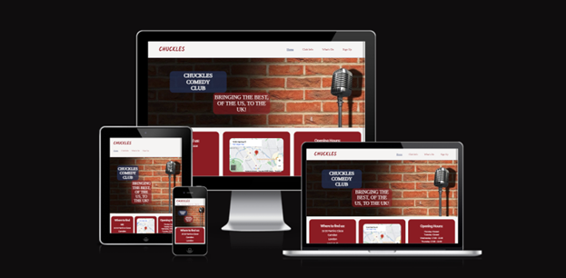
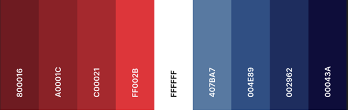

# Chuckles Comedy Club

The Chuckles Comedy Club website is an information website, for a comedy club specialising in American comics, based in London, UK.
This website is designed to provide information about the comedy club such as which acts will be performing, opening hours and how to find the venue

Visit the deployed site here: [Chuckles Comedy Club](<https://gkicks.github.io/chuckles-comedy-club/>)

# Contents

* [User Experience](#user-experience-ux)
    * [User Stories](#user-stories)
* [Design](#design)
    * [Color Scheme]
	* [Typography]
	* [Imagery]
	* [Wireframes]
* [Features]	
	* [General Features on Each Page]
    * [Future Implementations]
	* [Accessibility]
* [Technologies Used]
    * [Languages Used]
	* [Frameworks, Libraries and Programs Used]
* [Deployment and Local Development]	
	* [Deployment]
    * [Local Development]
        * [How to Fork]
        * [How to Clone]
* [Testing]	
* [Credits]
    * [Code Used]
    * [Content]
    * [Media]
    * [Other]
    * [Acknowledgements]

# User Experience (UX)

## Initial Discussion

Chuckles Comedy Club is a venue where the USP is that the performers are all American comedians. The website is user-friendly and easy to navigate, allowing users to quickly find the information they need.

### Key Information for the Site

* Which comedians are performing
* Where to find the venue
* The venue’s opening hours
* The ability to sign up to a newletter to receive discounts and further information

## User Stories

### Client Goals

* To be responsive on a range of devices
* Entice potential customers to visit the club
* Allow potential / returning customers to sign up to a newsletter

### First Time Visitor Goals

* To be able to easily navigate the website
* Understand the features of the website
* Understand the USP of Chuckles Comedy Club
* Be able to easily find the location of the club
* Know which acts are performing
* Sign up to receive more information

### Returning Visitor Goals

* Be able to see any new acts added
* Be able to hear an audio clip of the performers routine

### Frequent Visitor Goals

* Ability to check who is performing in the upcoming week
* To link into the club’s social media

# Design

## Colour Scheme

* Three colours have been used throughout the website - #F6F4F3, #002962 and #a0001c
* I chose colours to reflect those of the American flag – red, white and blue 
* I began with a colour pallette from the website Coolors that reflected these colours: 

