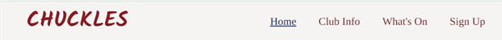
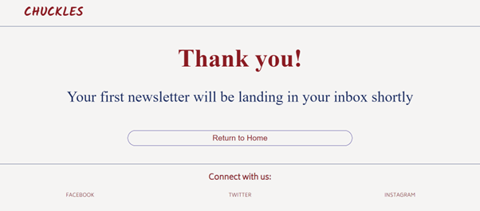
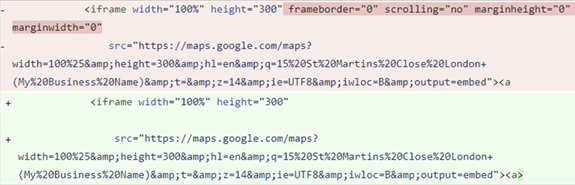
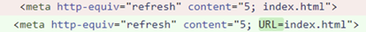
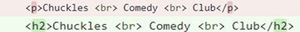
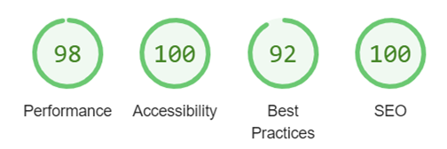
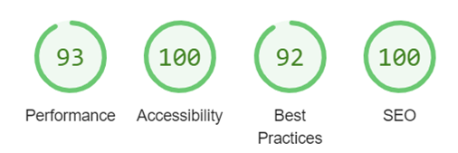
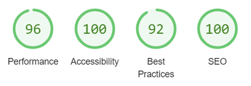
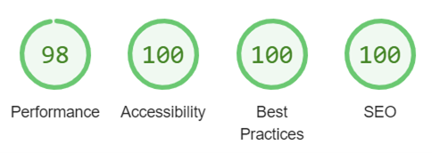
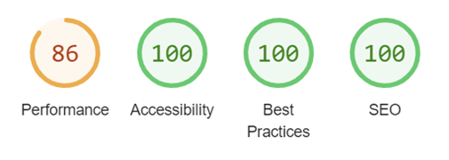

# Chuckles Comedy Club

The Chuckles Comedy Club website is an information website, for a comedy club specialising in American comics, based in London, UK.
This website is designed to provide information about the comedy club such as which acts will be performing, opening hours and how to find the venue

Visit the deployed site here: [Chuckles Comedy Club](<https://gkicks.github.io/chuckles-comedy-club/>)

# Contents

* [User Experience](#user-experience-ux)
  * [User Stories](#user-stories)
* [Design](#design)
  * [Color Scheme](#colour-scheme)
  * [Typography](#typography)
  * [Imagery](#imagery)
  * [Wireframes](#wireframes)
* [Features](#features)
  * [General Features on Each Page](#existing-features)
  * [Future Implementations](#future-implications)
  * [Accessibility](#accessibility)
* [Technologies Used](#technologies-used)
  * [Languages Used](#languages-used)
  * [Frameworks, Libraries and Programs Used](#frameworks-libraries-and-programs-used)
* [Deployment and Local Development](#deployment-and-local-development)
  * [Deployment](#deployment)
  * [Local Development](#local-development)
    * [How to Fork](#how-to-fork)
    * [How to Clone](#how-to-clone)
* [Testing](#testing)
* [Credits](#credits)
  * [Code Used](#code-used)
  * [Content](#content)
  * [Media](#media)
  * [Other](#other)
  * [Acknowledgements](#acknowledgements)

[Back to top](#chuckles-comedy-club)

# User Experience (UX)

## Initial Discussion

Chuckles Comedy Club is a venue where the USP is that the performers are all American comedians. The website is user-friendly and easy to navigate, allowing users to quickly find the information they need.

### Key Information for the Site

* Which comedians are performing
* Where to find the venue
* The venue’s opening hours
* The ability to sign up to a newletter to receive discounts and further information

## User Stories

### Client Goals

* To be responsive on a range of devices
* Entice potential customers to visit the club
* Allow potential / returning customers to sign up to a newsletter

### First Time Visitor Goals

* To be able to easily navigate the website
* Understand the features of the website
* Understand the USP of Chuckles Comedy Club
* Be able to easily find the location of the club
* Know which acts are performing
* Sign up to receive more information

### Returning Visitor Goals

* Be able to see any new acts added
* Be able to hear an audio clip of the performers routine

### Frequent Visitor Goals

* Ability to check who is performing in the upcoming week
* To link into the club’s social media

[Back to top](#chuckles-comedy-club)

# Design

## Colour Scheme

* Three colours have been used throughout the website - #F6F4F3, #002962 and #a0001c
* I chose colours to reflect those of the American flag – red, white and blue
* I began with a colour pallette from the website Coolors that reflected these colours:

* I wanted the white to be an off white, to make the website easier on the eye, so again chose a colour from the coolers website. I took this from another red / blue pallette so this would compliment the red and blue shades already chosen

## Typography

* I used Fontjoy, a font pairing website, to help me make font choices. I selected Kalam, a cursive font, as I felt that reflected the comedy theme. This font was only used for the logo and submit button as I wanted simpler fonts throughout the rest of the website – I chose Biryani and Tinos as these fonts

* To give interest to the social media links I took icons from the website <https://fontawesome.com/icons>

## Imagery

### Favicon

* I created the favicon from the website <https://www.favicon.cc>

* I wanted the favicon to be an image of the American flag, both to refelct the USP of the venue and the colours used throughout the website
* The images of the American flag I found were too detailed to use as a favicon so, I chose to create my own, to create a simple image

### Hero Image

* I found this image on the website pixabay.com
* The original image had the word ‘comedy’ in neon green letters. The did not match the colour scheme of the website so I cropped this part of the image out

### Map

* I used the website <https://www.maps.ie/create-google-map/> to generate a map of the location of the club and to create an iframe to embed in my index.html page

### Comedian and Flag Images

* These  images were all found on the website <https://unsplash.com/>.

All images were converted to .webp format to reduce file size and therfore speed up loading times

## Wireframes

* Wireframes were created using figma.com

### Desktop

#### Index.html

#### Whatson.html

#### Signup.html

View desktop wireframes on the Figma site: [Desktop](https://www.figma.com/file/g8UMWjEqGGzqNK4ILENLc6/chuckles-desktop?type=design&node-id=5%3A134&mode=design&t=R67yqhAAFlnPz3b1-1)

### Mobile

View mobile wireframes on the Figma site: [Mobile](https://www.figma.com/file/rPmex36OVOWyKsoamizYnI/Untitled?type=design&node-id=1%3A68&mode=design&t=vhfg9gbQQrPA39VQ-1)

[Back to top](#chuckles-comedy-club)

# Features

## Existing Features

### The Navigation Bar

* The navigation bar features on all three pages of the Chuckles Comedy Club website. It includes links to the home, what’s on and signup pages as well as links to the address and opening hours sections of the home page. The navigation bar also features a logo which will direct the user back to the home page
* The navigation bar is identical on each individual page to support the cohesiveness of the website
* The navigation is fully responsive and allows the user to easily navigate throughout the website
* Each navigation item includes an aria-label to improve accessibility for those using assistive technology

### The Landing Page

* The landing page includes a hero image of a microphone in front of a brick wall. There are text boxes, overlaying the image, which contain the name of the club and a slogan explaining the unique selling point of the club. When the user first lands on the website the colour of these boxes switches. This draws the user’s eye to this important information as well as giving some interest to the page

### Information Section

* The information section gives the user the address (a fake address has been used) and opening hours of the club
* It features an interactive map with a link for the user to be able to view a larger map. This opens in a new browser page which prevents the user needing to press the back button or closing the webpage in error

### Footer

* The footer features on all three main pages of the website as well as the thank you page following the user completing the signup form
* The footer contain links to the social media sites Facebook, Twitter and Instagram. Chuckles Comedy Club currently doesn’t have social media pages but, once these are created, the links will link to these
* The styling of the footer reflects that of the header to simplify the user experience
* Each footer item have an aria link to improve accessibility for those using assistive technology

### Whats On

* The What’s On page shows the user the acts that will be performing the coming weekend
* There are three performers shown each night and each performer is shown with their name (fake names used), photo and a short audio clip of their stand-up routine

### Sign Up

* The Sign Up page allows users to sign up to receive emails and special offers for upcoming events
* The background image used is an American flag to symbolise the nationality of the comics performing
* There are three input fields for the user to enter their forename, surname and email address. These have aria-labels to improve accessibility for those users using assistive technology
* All three inputs require data to be entered before allowing the user to submit the form. The email input requires the data to be entered in the form of an email address
* There is also a select dropdown box that would be used to collect data, for the comedy club, to be able to pinpoint where to focus their marketing strategy

### Thank you

* The thank you page is displayed when the sign up form is submitted. This gives the user confirmation that their request has been received
* The thank you page informs the user that they will be redirected back to the home page in five seconds and also gives the option to press a ‘return to home’ button to return to the index.html page

## Future Implications

* The functionality to be able to purchase tickets, to performances, through the website
* More information about venue facilities – i.e., food and drink menus, disability access
* Search function to allow users to search the website
* A FAQ page to be added

## Accessibility

* All pages use semantic html
* Aria-labels were used to improve accessibility for those using assistive technology
* I used the Google Chrome extensions:
  * Wave Evaluation Tool – no errors were detected
  * Web Disability Simulator – simulated the website for people with sight, mobility, reading and writing and concentration disabilities to view the webpage how others could see it. There were no concerns noted in these simulations
  * Screen Reader – Simulated how the website experience would be for a user using a screen reader. There were no concerns noted using this simulation
  * I used <https://webaim.org/resources/contrastchecker/> to check the contrasts of the colours chosen. This passed for both combinations of red and white (contrast ratio 7
.62:1) and blue and white (contrast ratio 12.82:1). This failed for the blue and red combination (contrast ratio 1.68:1) so this was not used in the website

[Back to top](#chuckles-comedy-club)

# Technologies Used

## Languages Used

HTML, CSS were mainly used to create this website. I used a small section of JavaScript code to resolve a bug in the audio

## Frameworks, libraries and programs used

* Am I Responsive? To show the website image on a range of devices
* Clideo - To convert audio clips to MP3
* Codeanywhere – To write the code
* Compress2go - To compress images to reduce file size
* Convertio - To change images to webp format
* Faviconcc - To create favicon
* Figma – To create wireframes
* Font Awesome - For the iconography on the social media links
* Github - To save and store files
* Google Dev Tools – Used to troubleshoot and debug
* Google Fonts - To import the fonts used on the website
* Spotify – The library my audio clips were taken from

[Back to top](#chuckles-comedy-club)

# Deployment and Local Development

## Deployment

This site is deployed using Github pages:

* *Sign up and login to GitHub
* Find the GitHub repository <https://github.com/Gkicks/chuckles-comedy-club.git>
* Click “settings”
* In the lefthand navigation panel locate and click “pages”
* Change the branch from “none” to “main”
* Click “save”
* The website will then be deployed. This process my take a few minutes and then “your site is live at …” will appear towards the top of the page

## Local Development

### How to Fork

* Sign up and login to GitHub
* Find the GitHub repository <https://github.com/Gkicks/chuckles-comedy-club.git>
* Locate the “fork” button which is located towards the top of the page. Click this button

### How to Clone

* Sign up and login to GitHub
* Find the GitHub repository <https://github.com/Gkicks/chuckles-comedy-club.git>
* Locate the “<> Code” button and click this. This will bring up a new panel
* Click the local tab
* Decide if you would like to clone with HTTPS, SSH or GitHub CLI – copy the link shown under the one of your choosing
* Open your code editor
* Open a new terminal in your code editor and change the working directory to the location you want to use for the clone directory (you can use the cd command to change directories)
* When you are in your chosen directory type “git clone” followed by pasting in the URL you copied in GitHub
* Press enter to execute the command and your clone will be created

[Back to top](#chuckles-comedy-club)

# Testing

I tested the website in the following browsers:

* Chrome
* Edge
* Firefox

I also used Chrome Developer tools to test how the screen looked and worked on each device screen and also used these tools to look for bugs throughout designing and building the website.

I posted a link to my website in the slack channel peer-code-review, but didn’t get any comments left, so I asked friends and family to test the website on their devices. There was one concern raised from this which was that the audio elements didn’t stop playing when another audio element started. This meant that the audio could all play over each other. I fixed this by finding some lines of JavaScript code (see credits section)

## WC3 Validator

I ran my HTML and CSS through the WC3 Validators. These were the errors that were returned from doing this:

* The validator returned that some of the code in the iframe was obsolete. I removed these parts as not needed

* WC3 validator returned that the iframe should not contain a link. I fixed this by removing the link code and the iframe still worked as it should

* The button on my thankyou.html page contained a link to return the user back to the home screen. The WC3 validator said a button cannot have a link. This was solved by wrapping the button in a form where the action was ‘index.html’

* There was an issue validating the code to automatically redirect the user back to the homepage, from the thankyou.html page. This was solved by adding URL= to index.html in the meta line

* The validator showed a warning that my code lacked headings. I solved this by changing a p section to an h2

* There were other minor issues found, such as there being an extra /li in my code, or a space in an id, that were resolved straight away

The website now passes all WC3 validation for each page:  

## Lighthouse

I used Lighthouse, within the Chrome developer tools, to check the performance, accessibilty, SEO and best practice of the website

### Index.html

#### Desktop

#### Mobile

### Whatson.html

#### Desktop

#### Mobile

### Signup.html

#### Desktop

#### Mobile

## Bugs

### Resolved Bugs

* The links in the navigation bar and footer were ‘jerky’ when hovered over. This was due to a border being added when the user hovers over the link.
  * Solution – I added a border to all the links and gave this border the same attributes as the hover border, except the colour, which matched the background colour so it didn’t display
* The hero image was taking a long time to download
  * Solution – initially I added a preload instuction into the head of the html. I took this advice from the website wpspeedmatters.com/speed-up-background-images/. However, on further reasearch, I realised this wasn’t best practice and so removed this and focused on reducing the file size and converting the jpeg to webp. I also added loading=”lazy” to iframe to free up processing time for main-photo
* The nav bar was quickly distorting on smaller screens
  * Solution – I changed the display to flex
* There was an area of blank screen to the right side of each page
  * Solution – I added overflow-x: hidden to the body and html, using css
* Pressing the ‘submit’ button in signup.html was not taking the user to the thankyou.html page
  * Solution - Following discussion with my mentor I removed method:post (this is only needed if there is a backend database in place)
* The border, on the select element of signup.html, was turning black when the option was changed
  * Solution – I changed the border to an outline, following advice from the website <https://stackoverflow.com/questions/492627/change-border-color-on-select-html-form>
* Although the background image, on the signup.html page, was loading from app.codeacademy this was not loading on the deployed site
  * Solution - With help from Tutor Support I found there was a / in front of asset, in my filepath, that shouldn’t have been there. This was removed
* The audio elements were playing over each other
  * Solution – I copied JavaScript code from the website <https://stackoverflow.com/questions/19790506/multiple-audio-html-auto-stop-other-when-current-is-playing-with-javascript>

### Unresolved Bugs

None that I know of

[Back to top](#chuckles-comedy-club)

# Credits

## Code Used

1.
        document.addEventListener('play', function (e) {
            var audios = document.getElementsByTagName('audio');
            for (var i = 0, len = audios.length; i < len; i++) {
                if (audios[i] != e.target) {
                    audios[i].pause();
                }
            }
        }, true);

This code was taken from the website <https://stackoverflow.com/questions/19790506/multiple-audio-html-auto-stop-other-when-current-is-playing-with-javascript> and was used for the audio elements so that, when another audio was played, the current one playing would stop

1.

I adapted this code, from the website <https://www.tutorialspoint.com/How-to-automatically-redirect-a-Web-Page-to-another-URL> to automatically divert the user from the page thankyou.html, to index.html, after five seconds

## Content

All content was written by Gail Kicks

## Media

All photos were taken from the websites unsplash.com and pixabay.com
The audio clips were taken from Spotify. I converted these to MP3 using clideo.com

The comedians used for my audio clips were:

* John Mulaney – Don Delaney
* Roni Dove – Loni Love
* Tim Hannigan – Jim Gaffigan
* Hayley Wilkinson – Taylor Tominson
* Tammy Curham – Jen Kirkman
* Nathan Garzee – Nate Bargatze

## Other

I used the following resources to expand my knowledge of html and css:

* The Code Institute lessons, including the LoveRunning project
* The Ultimate 2023 Fullstack Web Developer Bootcamp on Udemy
* webdesign.tutsplus.com
* developer.mozilla.org
* stackoverflow.com
* wpspeedmatters.com
* w3schools.com
* csstricks.com
* Code Institute’s Slack community

## Acknowledgements

I would like to acknowledge the following people for their help in completing my project:

* My mentor, Graeme Taylor, for his advice and ideas
* My family and friends for helping me during the testing stages
* The Tutor Support team at Code Institute
* The Code Institute Slack community
* Kera Cudmore for her fantastic README presentation

[Back to top](#chuckles-comedy-club)
